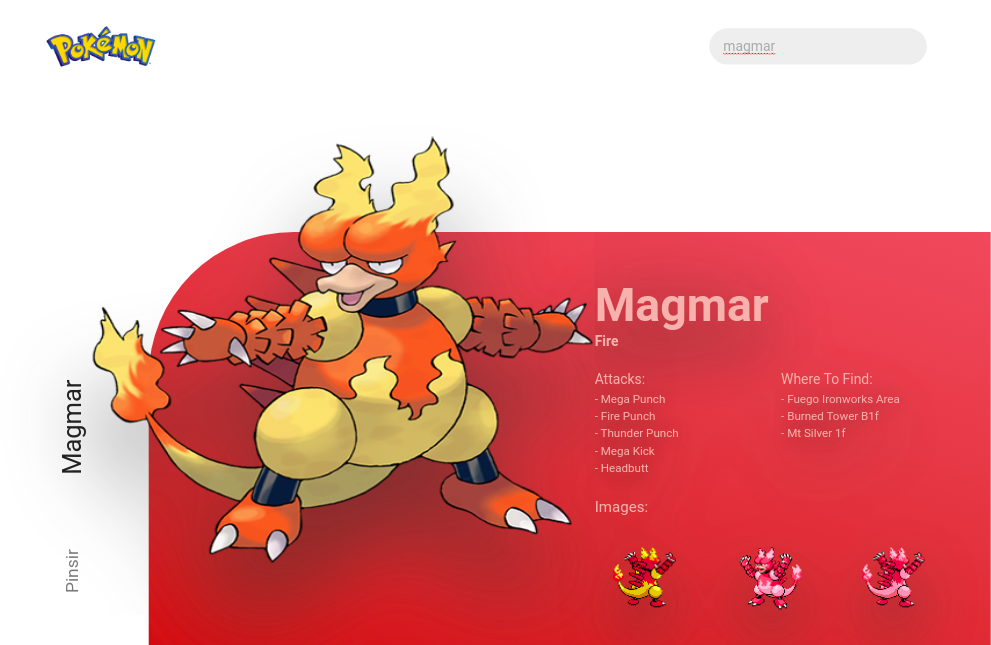

# Find Your Pokémon

## Using Next js with Static Site Gerenation (SSG)

## Prints



## Demo - https://nextjs-ssg-pokemon.vercel.app/

## Design

Designed based on @realvjy, HTML/CSS (desktop version) developed by @DaniloLima122 and other features developed by myself.

## Requirements

For development, you will only need Node.js installed on your environement.

## Install Node

[Node](http://nodejs.org/) is really easy to install & now include [NPM](https://npmjs.org/) or [YARN](https://yarnpkg.com/pt-BR/).
You should be able to run the following command after the installation procedure
below.

    $ node --version
    v10.15.2

    $ npm --version || yarn --version
    6.9.0

## Run project on development mode:

```
$ npm i
$ npm run dev
```

## Generate a build:

```
$ npm i
$ npm run build
```

## Run project on production mode:

```
$ npm i
$ npm run build && npm run start
```
